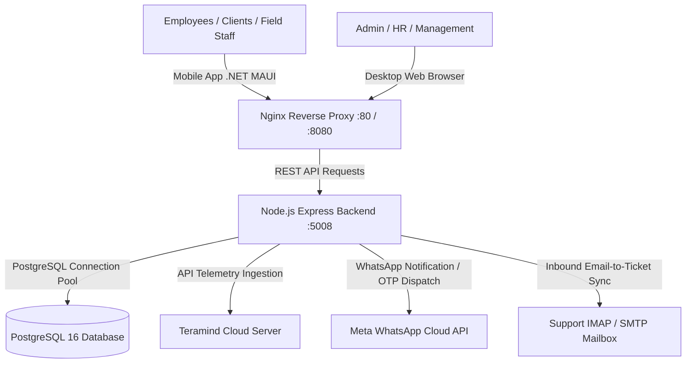

# 🏢 PCS Workforce Enterprise - Employee & Operations Management System (EMS)

[](https://github.com/malhar2005web/employee_management_system)
[%20%7C%20Express-10b981?style=for-the-badge&logo=node.js)](https://nodejs.org/)
[](https://www.postgresql.org/)
[](https://dotnet.microsoft.com/en-us/apps/maui)
[](https://developers.facebook.com/)

An enterprise-grade, full-stack Human Resource Management System (HRMS), Workforce Operations Platform, and Helpdesk CRM. Engineered for high-throughput enterprise environments with real-time biometric and Teramind PC telemetry sync, GPS-verified out-entry gate passes with client WhatsApp OTP verification, dynamic monthly payroll calculation, automated email ticketing, and a native .NET MAUI Android mobile client.

---

## 📑 Table of Contents
1. [System Overview & Architecture](#-system-overview--architecture)
2. [Technology Stack](#-technology-stack)
3. [Admin Portal Modules (Detailed)](#-admin-portal-modules-detailed)
   - [1. Executive Dashboard & Live Operations](#1-executive-dashboard--live-operations)
   - [2. Organization & User Management](#2-organization--user-management)
   - [3. Customer, Branch & Plant Directory](#3-customer-branch--plant-directory)
   - [4. Project & Contract Lifecycle Management](#4-project--contract-lifecycle-management)
   - [5. Task, Milestone & Handover Management](#5-task-milestone--handover-management)
   - [6. Daily Attendance & Check-In Intelligence](#6-daily-attendance--check-in-intelligence)
   - [7. Monthly Payroll, Overtime & Pricing Register](#7-monthly-payroll-overtime--pricing-register)
   - [8. Out Entry / Gate Pass & Client OTP Workflow](#8-out-entry--gate-pass--client-otp-workflow)
   - [9. Leave & Holiday Policy Administration](#9-leave--holiday-policy-administration)
   - [10. Workstation Telemetry & Remote Monitoring (Teramind)](#10-workstation-telemetry--remote-monitoring-teramind)
   - [11. Enterprise Helpdesk, CRM & Inbound Email Ticketing](#11-enterprise-helpdesk-crm--inbound-email-ticketing)
   - [12. KRA, Performance & Goal Review](#12-kra-performance--goal-review)
   - [13. Workload Balancing & Heatmaps](#13-workload-balancing--heatmaps)
   - [14. Communication Center & WhatsApp Broadcasts](#14-communication-center--whatsapp-broadcasts)
   - [15. Audit Logs, Data Export & Global Settings](#15-audit-logs-data-export--global-settings)
4. [Employee Portal Modules (Detailed)](#-employee-portal-modules-detailed)
   - [1. Employee Personalized Dashboard](#1-employee-personalized-dashboard)
   - [2. Attendance Tracking & Correction Requests](#2-attendance-tracking--correction-requests)
   - [3. Leave Center & Shared Half-Day Pool](#3-leave-center--shared-half-day-pool)
   - [4. Out Entry Gate Pass & Client Visit Flow](#4-out-entry-gate-pass--client-visit-flow)
   - [5. Interactive Task Timer & Handover](#5-interactive-task-timer--handover)
   - [6. Daily Status Reports (DSR) & Field Visit Logging](#6-daily-status-reports-dsr--field-visit-logging)
   - [7. Notification Inbox & Priority Alerts](#7-notification-inbox--priority-alerts)
   - [8. Employee Directory & Organization Tree](#8-employee-directory--organization-tree)
   - [9. Profile & Document Management](#9-profile--document-management)
5. [Cross-Platform Mobile Application (.NET MAUI)](#-cross-platform-mobile-application-net-maui)
6. [Background Workers & Automation](#-background-workers--automation)
7. [Database Schema & Architecture](#-database-schema--architecture)
8. [Installation & Deployment Guide](#-installation--deployment-guide)

---

## 🏛 System Overview & Architecture

PCS Workforce Enterprise is partitioned into three interconnected tiers:
1. **Cloud Core Web Backend**: Node.js ES Modules with Express and connection-pooled PostgreSQL, hosting secure RESTful APIs, scheduled background cron workers, and WebSockets.
2. **Premium Liquid-Glass Web Frontends**: Independent Admin and Employee web suites styled with curated CSS variables, dark-mode gradients, glassmorphism, and responsive CSS grid architectures.
3. **Cross-Platform Mobile App**: Built on .NET MAUI 10, delivering a responsive mobile interface with native hardware bridge integrations (GPS fine location tracking, background push notifications, and offline resilience).



---

## 💻 Technology Stack

### Backend
- **Runtime**: Node.js 20+ (Native ECMAScript Modules `type: "module"`)
- **Web Framework**: Express.js
- **Database Engine**: PostgreSQL 16 with `pg` connection pool
- **Authentication**: Stateless JSON Web Tokens (JWT) stored in HTTP-Only cookies and Bearer headers
- **Email Protocol**: `imap` / `mailparser` for real-time ticket conversion, `nodemailer` for transactional emails
- **Messaging Service**: Meta Graph API WhatsApp Cloud integration (`messages` endpoint)

### Frontend
- **Interface Structure**: Semantic HTML5 with custom liquid-glass design system
- **Styling**: Pure Vanilla CSS3 with bespoke custom properties (No heavy CSS framework overhead)
- **Icons & Visuals**: FontAwesome 6 Pro & curated SVG illustration sets
- **Data Exporting**: Client-side SheetJS (`xlsx`) and CSV exporter with automatic formatting

### Mobile Client
- **Framework**: Microsoft .NET MAUI 10 (Single Project architecture)
- **Target OS**: Android (API Level 21 to 34+)
- **Packaging**: Optimized Release AAB (Google Play) & Signed Standalone APK

---

## 🛡 Admin Portal Modules (Detailed)

### 1. Executive Dashboard & Live Operations
- **Real-Time Workforce Telemetry**: Live KPI cards displaying total employees, active clock-ins, remote telemetry online status, and pending approvals.
- **Attendance Pulse Gauge**: Visual breakdown of Present, Late, Absent, On-Duty, and Out-Entry counts for the day.
- **Task Velocity & Milestone Tracker**: High-level visual indicators showing tasks pending, in-progress, completed, and overdue.
- **Recent Audit Stream**: Real-time audit activity feed logging administrative actions, check-ins, leave submissions, and security authorizations.
- **Quick Workflow Actions**: One-click modal access to add employees, broadcast notices, create manual adjustments, and review urgent tickets.

### 2. Organization & User Management
- **Multi-Tier Company Hierarchy**: Configure and manage Departments, Designations, Shift Profiles, and Reporting Manager hierarchies.
- **Comprehensive Employee Master**: Detailed employee profiles containing Personal info, Contact info, Department, Designation, Reporting Manager, Shift assignments, Base Salary, Hourly Billing Cost, and Employment Status (Active/Suspended/Terminated).
- **Bulk Data Migration**: Import and Export employee datasets via formatted CSV and Microsoft Excel (`.xlsx`) files.
- **Role-Based Access Control (RBAC)**: Fine-grained authorization differentiating `Super Admin`, `Admin`, `HR`, and `Manager` capabilities.

### 3. Customer, Branch & Plant Directory
- **Customer Master**: Full profile management for clients, enterprise accounts, and external vendors.
- **Multi-Branch & Industrial Plant Support**: Define multiple branch locations and industrial plants under each customer with designated addresses, contact persons, and latitude/longitude coordinates.
- **Integrated SLA Tracking**: Configure SLA resolution windows and priority tiers for every customer.
- **Customer-Project Association**: Link active contracts, project codes, and support tickets directly to client branch locations.

### 4. Project & Contract Lifecycle Management
- **Project Setup & Budgeting**: Create projects with custom project codes, milestone roadmaps, assigned project leads, and budget estimates.
- **Resource Allocation**: Assign team members, track billable vs non-billable hours, and calculate project completion percentages.
- **Automated Contract Expiry Reminders**: Background cron worker scans contracts expiring within 7 days and dispatches automated WhatsApp reminders to project leads and customer accounts.

### 5. Task, Milestone & Handover Management
- **Task Delegation & Assignment**: Create tasks with rich descriptions, priorities (`Critical`, `High`, `Medium`, `Low`), due dates, and document attachments.
- **Interactive Handover Protocol**: Forward and handover tasks between employees with mandatory handover notes, transferring responsibility while preserving complete audit histories.
- **Active Task Sessions & Timers**: Track start, pause, resume, and completion timestamps with automatic calculation of total task durations.
- **Task Comments & Attachments**: Integrated collaboration stream supporting file uploads, progress notes, and revision logs.

### 6. Daily Attendance & Check-In Intelligence
- **Biometric & Teramind Punch Processing**: Ingests automated telemetry from desktop PC agents and web check-ins.
- **Standard Shift Normalization (9:00 AM – 7:00 PM)**: Automated attendance calculation identifying Present, Late arrivals (after grace period), and Early logouts. Punches outside working hours are intelligently classified to prevent skewed overtime.
- **Manual Attendance Correction Center**: Review employee regularization requests with clock-in/clock-out discrepancies, with one-click approve/reject actions that dynamically update attendance logs.

### 7. Monthly Payroll, Overtime & Pricing Register
- **Dynamic Month Selector**: Navigate across historical months or compute current-month payroll in real time.
- **Attendance Matrix Grid**: Interactive 31-day visual attendance matrix showing daily status codes:
  - `P`: Present (Full Day)
  - `A`: Absent
  - `L`: Approved Leave
  - `W`: WeekOff
  - `H`: Half Day Present / 2nd Half Leave
  - `LH`: 1st Half Leave / 2nd Half Present
  - `LP`: Paid / Annual Leave
  - `OVT`: Overtime Day
- **Total Late in Hours**: Tracks total cumulative monthly late hours per employee (converted from days for precise wage deduction).
- **Overtime Hours & Incentive Calculator**: Calculates approved overtime hours beyond normal shift windows and applies performance incentive algorithms.
- **Effective Hourly Cost & Financial Export**: Computes effective hourly billing cost per employee based on total hours worked and base salary, with full one-click export to Excel/CSV.

### 8. Out Entry / Gate Pass & Client OTP Workflow
- **Gate Pass Tracking**: Monitors official duties, client visits, bank runs, personal breaks, and medical emergencies.
- **Admin Approval Gate**: When an employee applies for an Out Entry, it enters **`Pending Approval`** status with duration paused. Admin can review destination, purpose, and expected return time.
- **Automated Client WhatsApp Verification OTP**: Upon Admin approval, a 4-digit Visit OTP is automatically generated and sent via WhatsApp to the client contact person.
- **GPS Telemetry & Live Duration Counter**: As soon as the employee enters the client's OTP at their premises, the live visit timer begins ticking, capturing periodic GPS coordinates until they return and click "Mark Return".

### 9. Leave & Holiday Policy Administration
- **Company Holiday Calendar**: Configure national, festival, and corporate holidays.
- **Configurable Leave Types**: Set up Casual Leave (CL), Sick Leave (SL), Paid / Annual Leave (PL), Compensatory Off (CO), and Half Day Leaves.
- **Shared Half-Day Leave Pool**: Both `1st Half Leave / 2nd Half Present (LH)` and `Half Day Present / 2nd Half Leave (H)` draw from a unified 6.0-day quota, deducting **0.5 days** per instance and preventing over-utilization.
- **Administrative Action Controls**: Approve or reject leave applications with automatic balance updates and instant employee notifications.

### 10. Workstation Telemetry & Remote Monitoring (Teramind)
- **Live Workstation State**: Real-time detection of Active, Idle, and Offline states directly from Teramind desktop agents.
- **Application & Website Tracking**: Logs applications executed and URLs visited with duration breakdowns.
- **Productivity Scoring Algorithm**: Computes productivity and focus scores based on productive vs unproductive categorizations.
- **Periodic Postgres Sync Worker**: Synchronizes desktop telemetry into a high-speed Postgres cache every 5 minutes for rapid dashboard rendering.

### 11. Enterprise Helpdesk, CRM & Inbound Email Ticketing
- **Automated Email-to-Ticket Conversion**: Background IMAP worker polls support mailboxes every 30 seconds, automatically converting incoming customer emails into structured support tickets.
- **Customer & Branch Auto-Linking**: Parses sender email addresses and automatically maps tickets to the customer, branch, and designated SLA in the database.
- **Ticket Workflow**: Assign engineers, update priorities (`Urgent`, `High`, `Normal`, `Low`), transition statuses (`Open`, `In Progress`, `Resolved`, `Closed`), and calculate resolution durations.
- **Direct WhatsApp Updates**: Send ticket status updates and resolution alerts directly to customer contacts via WhatsApp.

### 12. KRA, Performance & Goal Review
- **Key Result Areas (KRA)**: Define departmental KRAs with metric targets and scoring weightages.
- **Employee Evaluation**: Record quarterly and annual review ratings with feedback notes and performance category classifications.

### 13. Workload Balancing & Heatmaps
- **Capacity Utilization**: Visual analytics tracking which employees are overloaded, optimal, or underutilized.
- **AI Task Redistribution**: Smart suggestions to rebalance overdue tasks to team members with available bandwidth.

### 14. Communication Center & WhatsApp Broadcasts
- **Company Announcements**: Post rich corporate announcements with target audience filters.
- **WhatsApp Cloud Broadcasts**: Dispatch bulk notifications to employees and clients via Meta's WhatsApp Cloud API.

### 15. Audit Logs, Data Export & Global Settings
- **Tamper-Evident Audit Trails**: Logs user authentication, record mutations, leave approvals, and data exports.
- **Global Settings**: Configure company branding, working hours, shift windows, email templates, and backup schedules.

---

## 👨‍💻 Employee Portal Modules (Detailed)

### 1. Employee Personalized Dashboard
- **Daily Check-In Banner**: Instant clock-in / clock-out widget with running work session counter.
- **Active Task & Visit Alert**: Prominent banner for active client visits showing running duration timer and direct "Return to Office" action.
- **Leave Balance Summary Cards**: Real-time cards displaying available quotas for Casual, Sick, Paid, and Half-Day leaves.
- **Today's Action Feed**: Overview of assigned tasks, urgent notifications, and upcoming shift details.

### 2. Attendance Tracking & Correction Requests
- **Daily Logs**: Historical log of login times, logout times, login duration, overtime hours, and status badges.
- **Attendance Correction Request Modal**: Apply for attendance regularization when punches are missed or delayed, providing date, corrected times, and justification for Admin approval.
- **Monthly Attendance Filter**: Quick-filter by Current Month, Previous Month, or Full Year 2026.

### 3. Leave Center & Shared Half-Day Pool
- **Comprehensive Leave Quota Cards**:
  - `Casual Leave` (12.0 days)
  - `Sick Leave` (8.0 days)
  - `Paid / Annual Leave` (15.0 days)
  - `Compensatory Off` (5.0 days)
  - `Half Day Leave (Combined)` (6.0 days shared)
- **Flexible Half-Day Selection**: Choose between:
  - `1st Half Leave / 2nd Half Present (LH)`
  - `Half Day Present / 2nd Half Leave (H)`
- **Dynamic 0.5 Day Calculation**: Automatically previews `0.5 day will be applied` and reduces the shared 6.0-day quota regardless of which half is chosen.
- **Leave History & Status**: View pending, approved, and rejected leave applications with admin remarks.

### 4. Out Entry Gate Pass & Client Visit Flow
- **Apply Out Entry Modal**:
  - Select purpose: `Client Visit`, `Official Duty`, `Bank Work`, `Personal Work`, or `Emergency / Medical`.
  - Date, Out Time, and Expected In Time.
  - Customer dropdown and Customer Branch / Office dropdown with responsive text fitting.
  - Destination and detailed reason.
- **Admin Approval Gate**: Application displays **`⏳ PENDING APPROVAL`** with action **`🕒 Awaiting Admin`** until authorized by management.
- **Client Visit Verification**:
  - Once approved, the employee sees **`🔑 Enter Client OTP`**.
  - Upon arriving at the client's premises, the employee requests the 4-digit verification code that was delivered to the client via WhatsApp.
  - Submitting the OTP verifies arrival, stamps `visit_started_at`, and starts the live duration timer on their dashboard.
- **Mark Return**: Clicking "Mark Return" records actual in-time and calculates total duration.

### 5. Interactive Task Timer & Handover
- **Interactive Task List**: View tasks sorted by urgency and status.
- **Real-Time Stopwatch**: Start and stop timers directly on active tasks.
- **Task Forwarding / Handover**: Transfer tasks to colleagues with handover notes and file attachments.

### 6. Daily Status Reports (DSR) & Field Visit Logging
- **Daily Self-Report (DSR)**: Submit end-of-day progress logs: Today's Work, Tomorrow's Plan, Blockers, Work Capacity %, and Completion %.
- **Client Field Visit DSR**: Record on-site client visit details: Customer Name, Branch, Contact Person, Phone, Visited For, Follow-up notes, and Geolocation.

### 7. Notification Inbox & Priority Alerts
- Real-time inbox for Task assignments, Leave status updates, Gate pass approvals, and Corporate announcements.

### 8. Employee Directory & Organization Tree
- Search colleagues by Name, Department, or Designation with direct email and phone contact links.
- View reporting lines and team structures.

### 9. Profile & Document Management
- Manage personal details, emergency contacts, skills matrix, and secure password updates.

---

## 📱 Cross-Platform Mobile Application (.NET MAUI)

The system includes a production-ready mobile application built on **.NET MAUI 10**:
- **Application ID**: `com.companyname.ems.mobile`
- **Current Version**: `1.2.0` (Build `3`)
- **Pre-Built Packages**:
  - `EMS_Mobile_App.apk` (Root directory instant install)
  - `publish/Android/com.companyname.ems.mobile-Signed.apk` (Signed release package)
- **Mobile Capabilities**:
  - Full-screen hardware-accelerated WebView container connecting to live cloud servers.
  - Background and foreground GPS location services for field staff tracking.
  - Android 13+ `POST_NOTIFICATIONS` runtime permissions for push notifications.
  - Offline fallback screen with automatic network retry logic.

---

## ⚙️ Background Workers & Automation

The backend runs 5 automated background cron workers:
1. **Email-to-Ticket Worker (`every 30s`)**: Polls the IMAP support inbox, parses MIME emails, extracts attachments, auto-links customers, and creates support tickets.
2. **Teramind Telemetry Syncer (`every 5m`)**: Ingests active applications, websites, and productivity metrics from Teramind desktop agents into PostgreSQL.
3. **Delegation Expiry & Escalation Worker (`every 60s`)**: Escalates overdue delegated tasks to reporting managers.
4. **Contract Expiry Reminder Worker (`every 12h`)**: Sends WhatsApp notifications for customer contracts expiring within 7 days.
5. **System Heartbeat Monitor (`every 120s`)**: Monitors database connection pool health and worker statuses.

---

## 🗄 Database Schema & Architecture

The database schema includes 25+ relational tables in PostgreSQL:
- **Core Workforce**: `employees`, `users`, `departments`, `designations`, `shifts`, `holidays`
- **Attendance & Telemetry**: `attendance`, `attendance_corrections`, `teramind_user_mappings`, `teramind_telemetry_cache`, `monthly_payroll_records`
- **Leaves & Quotas**: `leaves`, `leave_requests`, `leave_types`, `leave_balances`
- **Gate Pass & Tracking**: `out_entries` (`expected_in_time`, `visit_otp`, `visit_started_at`, `last_latitude`, `last_longitude`)
- **CRM & Support**: `customers`, `tickets`, `ticket_comments`, `ticket_attachments`
- **Projects & Tasks**: `projects`, `tasks`, `task_sessions`, `task_handovers`
- **Reporting & Notifications**: `self_reports`, `dsr_reports`, `notifications`, `audit_logs`

---

## 🚀 Installation & Deployment Guide

### Prerequisites
- **Node.js**: v20.x or higher
- **PostgreSQL**: v15 or v16
- **.NET SDK**: v10.0+ (with `android` workload installed)
- **Android SDK**: Build-tools 34+

### 1. Backend Setup
```bash
# Clone repository
git clone https://github.com/malhar2005web/employee_management_system.git
cd employee_management_system/backend

# Install dependencies
npm install

# Configure Environment Variables (.env)
cp .env.example .env
# Edit .env with your PostgreSQL credentials, JWT secret, and SMTP settings

# Run migrations and start server
node server.js
```

### 2. Frontend Setup
Deploy the static frontend files located in `stitch_workforce_premium_saas/` via Nginx or Apache:
```nginx
server {
    listen 8080;
    server_name your-domain.com;
    root /var/www/employee_management_system/stitch_workforce_premium_saas;
    index login.html;

    location /api/ {
        proxy_pass http://127.0.0.1:5008;
        proxy_http_version 1.1;
        proxy_set_header Upgrade $http_upgrade;
        proxy_set_header Connection 'upgrade';
        proxy_set_header Host $host;
        proxy_cache_bypass $http_upgrade;
    }
}
```

### 3. Compiling the Mobile APK (.NET MAUI)
```powershell
# Open PowerShell in the maui folder
cd maui

# Execute the automated compilation pipeline
.\build-mobile.ps1
```
The compiled, signed APK will be generated at `publish/Android/com.companyname.ems.mobile-Signed.apk` and copied to the root directory as `EMS_Mobile_App.apk`.

---

## 📄 License
Proprietary Enterprise Software © 2026 PCS Enterprise / Limitless Infotech Solutions. All rights reserved.
